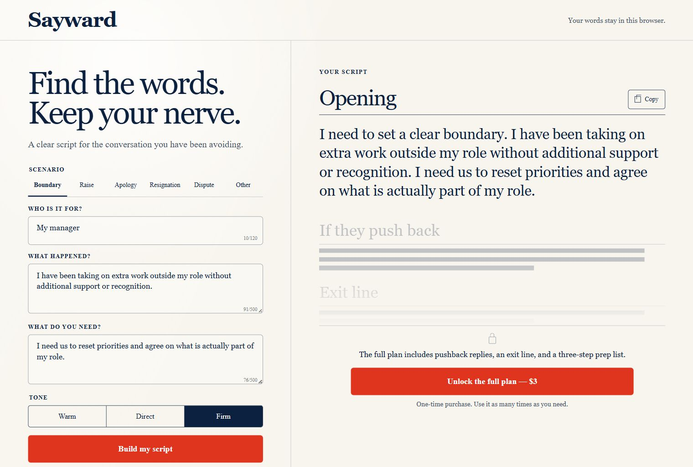

# Sayward

Sayward is a small paid browser tool for preparing difficult conversations. A visitor enters
the situation, person, desired outcome, and tone. The deterministic local engine returns a
free opening. A $3 one-time Stripe Payment Link unlocks the pushback reply, exit line, and
three-step preparation list in that browser.

The product deliberately does not use an AI API, database, account system, analytics SDK, or
application-side storage. Conversation drafts remain in the visitor's browser.

**Live product:** [sayward.bmparent.chatgpt.site](https://sayward.bmparent.chatgpt.site)



## Product shape

- Six scenarios: boundary, raise, apology, resignation, dispute, and other.
- Three tones: warm, direct, and firm.
- Free, immediately useful opening script.
- $3 one-time full-plan unlock through Stripe-hosted checkout.
- Responsive editorial UI with reduced-motion support.
- Plain-language privacy and terms pages.
- Static social preview image at `public/og.png`.

## Run from the repository root

Requires Node.js 22.13 or newer.

```bash
npm install
npm run dev
```

The live Payment Link is compiled as the production-safe default. To point a local or preview
build at a different public Payment Link, create `.env.local` from `.env.example` and override:

```text
NEXT_PUBLIC_STRIPE_CHECKOUT_URL=https://buy.stripe.com/...
```

Payment Link URLs and `NEXT_PUBLIC_STRIPE_CHECKOUT_URL` are intentionally public. Never place a
Stripe secret key in a `NEXT_PUBLIC_` variable or in this repository.

## Validation

```bash
npm run lint
npm test
```

`npm test` builds the production worker, checks the server-rendered product and policy pages,
and runs the real conversation engine across every scenario/tone combination.

## Payment return design

Stripe redirects a successful purchase to the public Sayward URL with the configured `unlock`
query value. The browser then stores `sayward-lifetime-access=yes` in local storage and removes
the query string from the visible URL.

This is an intentionally low-complexity paywall for a $3 static product. The return value is
present in client code and is not equivalent to server-verified entitlement. It can be bypassed
by a technical user and it does not synchronize across devices. Replacing it with a Stripe
Checkout Session plus a server-side webhook/entitlement record is the appropriate upgrade if
revenue or abuse justifies accounts and persistent restore access.

## Privacy behavior

- Draft fields are not sent to an application endpoint.
- Stripe handles payment-card data on Stripe-hosted pages.
- The browser stores only the purchase-access flag, not draft or card data.
- The hosting layer may retain ordinary request/security logs.
- No advertising tracker or analytics cookie is included.

## Deployment

The project is configured for ChatGPT Sites in `.openai/hosting.json`. Build from the repository
root, package the validated output with the Sites packaging helper, save a version tied to the
source commit, and deploy that exact version. The production fallback in `app/commerce.ts` is the
active $3 Payment Link; an environment variable may override it for a separate preview.

## Known limits

- Generated text is template-based writing support, not professional advice.
- Access is local to the browser that returns from checkout.
- Clearing site storage removes the access flag.
- The app does not promise that a conversation will have a particular outcome.
